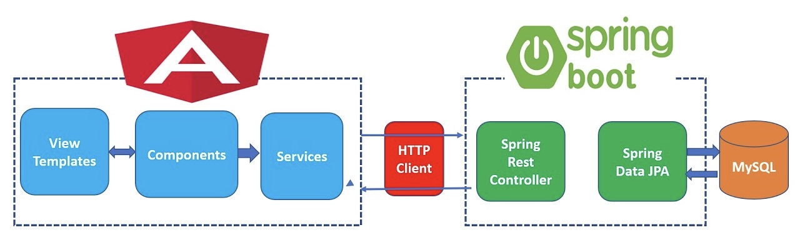

# expense_tracker
Expense Tracker Web Application to track expenses for the user.

## Objective
This application was built to help me learn more about Full-Stack Web Development. It is not intended for commercial use. 
It follows a very basic architecture patterns, please read on to find out more about the technologies used in the application. 

## Tools Used 
 - Angular
 - Spring Boot - Spring Hibernate & JPA
 - MySql
 
## Architecture Design

# Run & Compile
We will be using Docker to build and run the project. Please follow the steps listed below:

# Build
- Install NPM & Angular (Setup)[https://angular.io/guide/setup-local]
- Clone the project
- Run `npm install`
- Enter `ng serve`

Run `ng build` to build the project. The build artifacts will be stored in the `dist/ directory`. Use the `--prod` flag for a production build.
